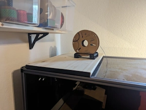
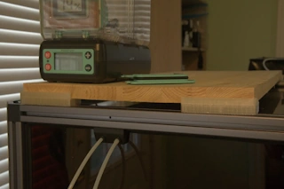

# Modifications

This page contains useful modifications and accessories for the Snapmaker Artisan.

---

## Top Shelf

A convenient top shelf for storing tools and accessories on top of the enclosure.

### Source

- https://www.printables.com/model/710922-snapmaker-artisan-top-shelf

### Notes

-

---

## Enclosure Shelf Brackets

Shelf brackets for adding additional storage space to the Snapmaker Artisan enclosure.

### Source

- https://www.printables.com/model/1176751-snapmaker-artisan-enclosure-shelf-brackets

### Notes

-
