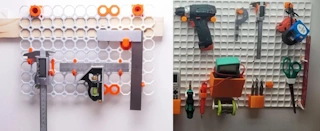

# MultiBoard, openGrid and Underware

**Date:** 2026-07-26

> This page was created with the assistance of ChatGPT. Information and links should be verified when they are used for a project, printing decision or purchase.

[](https://www.reddit.com/r/Multiboard/comments/1mivpcg/opengrid_vs_multiboard_the_battle_for_the_future/)

A discussion on [Woodworking.nl](https://www.woodworking.nl/threads/multiboard-french-cleats-alternatief.45826/) discusses MultiBoard as a 3D-printed alternative to conventional pegboard and French-cleat storage.

The discussion is partly based on this YouTube video:

[](https://www.youtube.com/watch?v=zgMPVfaCOPs)

## Relationship

[MultiBuild](https://multibuild.io/) is the wider modular organisation ecosystem.

MultiBoard is one of the mounting systems within MultiBuild:

```text
MultiBuild
├── MultiBoard
├── MultiBin
└── related components
```

openGrid is a separate modular mounting system.

It is not part of MultiBuild:

```text
MultiBoard = mounting system within MultiBuild
openGrid   = separate mounting ecosystem
```

[Underware 2.0](https://makerworld.com/nl/models/783010-underware-2-0-infinite-cable-management?appSharePlatform=copy#profileId-1504508) is a cable-management concept rather than a competing wall-grid system.

Underware has system-specific implementations for both mounting systems:

```text
Underware
├── Underware 2.0 for MultiBoard
└── Underware for openGrid
```

The general cable-routing concept is similar, but the physical attachment to the base board differs.

## Shared Principle

MultiBoard and openGrid use the same broad principle:

```text
printed tiles
    ↓
mounted to a wall, desk or frame
    ↓
removable accessories attached to repeated grid positions
```

Both can be used for holders, shelves, tools, electronics and cable management.

The technical implementations are similar in purpose, but they are not directly interchangeable.

## Main Technical Differences

| Detail | MultiBoard | openGrid |
|---|---|---|
| Grid spacing | 25 mm | 28 mm |
| Ecosystem | Part of MultiBuild | Independent system |
| Connection approach | Multiple connector, snap and threaded options | Mainly based around grid snaps |
| Base-board options | Different MultiBoard tiles and mounting methods | Full and Lite board variants |
| Accessory compatibility | Designed around the MultiBuild dimensions | Uses its own 28 mm dimensions and offers some adapters |
| Licence approach | MultiBuild-specific licence | More explicitly open-source oriented |

The difference in grid spacing is important:

```text
MultiBoard = 25 mm
openGrid   = 28 mm
```

Accessories using one mounting position may sometimes be adapted.

Accessories using several mounting positions normally need a system-specific design because the spacing increasingly diverges across multiple grid cells.

## MultiBoard

Possible advantages:

- Broad ecosystem of existing holders, bins, shelves and accessories
- Integration with other MultiBuild components such as MultiBin
- Several connection methods for different applications
- Large amount of existing community material
- Mechanical locking and heavier mounting options

Possible disadvantages:

- More connector types can make the system harder to understand
- Large installations require considerable printing time and filament
- Many accessories require additional small printed parts
- The licence is more restrictive than a conventional open-source licence
- Accessories are tied to the MultiBoard dimensions and connector geometry

## openGrid

Possible advantages:

- Relatively simple grid-and-snap concept
- Full and Lite board options
- Open development and modification are important parts of the project
- Generators and compatibility adapters are available
- The newer Underware implementation is designed specifically for openGrid
- The Lite board can reduce printing time and material use

Possible disadvantages:

- Newer and possibly less extensive ecosystem
- Existing MultiBoard accessories do not automatically fit
- Multi-position accessories must match the 28 mm grid
- Adapters can introduce extra parts and complexity
- Some accessory categories may be less mature than those available for MultiBoard

## Underware

Underware provides modular cable channels and related cable-management parts.

The original Underware 2.0 version was designed for MultiBoard.

The model page now mentions a newer Underware implementation for openGrid and recommends considering openGrid when starting a new installation.

This does not mean that the same physical Underware parts fit both systems without modification.

A more precise summary is:

```text
Underware concept       = shared
board attachment        = system-specific
MultiBoard and openGrid = separate systems
```

## Community Comparison

A detailed [Reddit discussion](https://www.reddit.com/r/Multiboard/comments/1mivpcg/opengrid_vs_multiboard_the_battle_for_the_future/) compares openGrid and MultiBoard from a practical user perspective.

The comparison discusses subjects such as:

- Licensing
- Board printing time
- Strength
- Mechanical locking
- Available accessories
- Gridfinity integration
- MultiBin integration
- Maturity of the ecosystems

The author considers openGrid stronger in areas such as open licensing, simpler board construction and the availability of the Lite board.

MultiBoard is considered stronger in areas such as mechanical locking, heavier mounting, the size of the existing parts library and integration with MultiBin.

This is one community member's assessment rather than an independent technical test, but it provides a useful overview of practical differences between the systems.

## Metal Grid Alternative

Another approach is shown in this [YouTube video](https://www.youtube.com/watch?v=y-j40p3TKt4).

Instead of printing a complete MultiBoard or openGrid wall, the video uses a commercially available metal wire grid as the base structure.

The general approach becomes:

```text
metal wire grid
        ↓
standard or printed hooks and holders
        ↓
tools, parts and cables
```

Possible advantages include:

- No need to print a large number of base tiles
- Less filament and printing time
- A rigid base structure is immediately available
- Standard hooks and baskets may already fit
- Custom 3D-printed holders can still be added where useful

Possible disadvantages include:

- The spacing and wire dimensions are determined by the purchased grid
- Printed accessories must match the specific wire geometry
- The surface is less continuous than a printed board
- Accessory positioning may be less precise
- Compatibility with MultiBoard or openGrid parts is not automatic

This approach separates the base structure from the accessory system:

```text
MultiBoard or openGrid
= printed base and printed accessory interface

metal wire grid
= purchased base with standard or custom accessories
```

It may be a practical alternative when the main goal is workshop storage rather than using a specific modular ecosystem.

## Summary

MultiBoard and openGrid solve a similar problem but use different grid dimensions and connector designs.

```text
MultiBuild  = wider organisation ecosystem
MultiBoard  = 25 mm mounting system within MultiBuild
openGrid    = separate 28 mm mounting system
Underware   = cable-management concept implemented for both systems
metal grid  = non-printed base with standard or custom holders
```

MultiBoard appears to offer a broader and more mature integrated storage ecosystem.

openGrid appears to place more emphasis on a simpler snap interface, open development and compatibility adapters.

A metal wire grid provides a simpler alternative when printing the complete mounting surface is not necessary.

## Sources

- [Woodworking.nl — Multiboard, French cleats alternatief?](https://www.woodworking.nl/threads/multiboard-french-cleats-alternatief.45826/)
- [MultiBuild](https://multibuild.io/)
- [Underware 2.0 for MultiBoard](https://makerworld.com/nl/models/783010-underware-2-0-infinite-cable-management?appSharePlatform=copy#profileId-1504508)
- [Reddit — openGrid vs MultiBoard: The Battle for the Future of Wall Storage](https://www.reddit.com/r/Multiboard/comments/1mivpcg/opengrid_vs_multiboard_the_battle_for_the_future/)
- [YouTube — MultiBoard workshop storage](https://www.youtube.com/watch?v=zgMPVfaCOPs)
- [YouTube — Workshop storage using a metal wire grid](https://www.youtube.com/watch?v=y-j40p3TKt4)