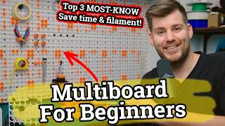
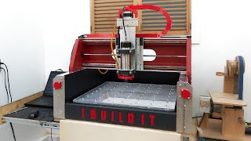
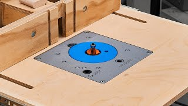
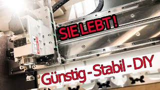
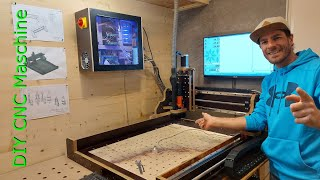

# 2026-07

## 2026-07-26

### MultiBoard, openGrid and Underware

> This note was created with the assistance of ChatGPT. Information should be verified before making design, printing or purchasing decisions.

A [Woodworking.nl discussion](https://www.woodworking.nl/threads/multiboard-french-cleats-alternatief.45826/) discusses MultiBoard and Underware as a 3D-printed alternative to conventional pegboard or French-cleat storage.

The discussion is partly based on the following YouTube video:

[](https://www.youtube.com/watch?v=zgMPVfaCOPs)


MultiBoard and openGrid are separate modular mounting systems. Underware is a cable-management concept with system-specific implementations for both platforms.

- [MultiBoard, openGrid and Underware](./26/multiboard-opengrid-underware)


### CNC Mill Build

> This note was created with the assistance of ChatGPT.

This YouTube video documents the construction of a CNC milling machine:

[](https://www.youtube.com/watch?v=wFpyW5FwmGk&t=239s)

The build may provide useful ideas for CNC-machine construction, mechanical layout and component selection.

### 3D-Printed Router Lift

> This note was created with the assistance of ChatGPT.

This YouTube video shows a 3D-printed router lift:

[](https://www.youtube.com/watch?v=dJLjQ146v2A)

The design may be useful as a reference for combining 3D-printed parts with a router-table height-adjustment mechanism.


### Docsify Documentation Portal Publisher Guide

> This note was created with the assistance of ChatGPT.

The [Documentation Portal Publisher Guide](https://docs.developer.tech.gov.sg/docs/documentation-portal-publisher-guide/?product=Singapore+Government+Developer+Portal) from the Singapore Government Developer Portal is a useful practical reference for building and publishing documentation with Docsify.

The guide includes information about:

- Docsify setup and configuration
- Markdown syntax
- Mermaid diagrams
- Accordion content
- Sidebar configuration and plugins
- Examples of other websites using Docsify

It may be useful both as a Docsify reference and as a source of ideas for improving the structure and navigation of this notebook.


### Life Latitudes CNC Build

This video shows an interesting CNC-machine design:

[](https://www.youtube.com/watch?v=s7sBc1GatWA&t=1357s)

The build uses a `GDZ80X73` spindle.

[HC-Maschinentechnik](https://hc-maschinentechnik.de/) appears to offer useful components and prepared sets for this CNC design.

Relevant products include:

- [Life Latitudes CNC-machine component set](https://hc-maschinentechnik.de/Grondstof-Life-Latitudes-freesmachineset-incl-gaten-schroefdraad)
- [Life Latitudes milling-cutter starter set](https://hc-maschinentechnik.de/Life-Latitudes-frees-starterset)

The component set may be useful because parts are available with holes and threads already machined.

The cutter starter set contains cutters intended for materials such as aluminium, plastics and wood.

### RAPTOR MPX Wooden DIY CNC

Another CNC design is shown in this video:

[](https://www.youtube.com/watch?v=kY_ZBwZwKUE&t=1s)

The accompanying [RAPTOR MPX CNC website](https://www.dolomites-paragliding.com/diycnc) describes a wooden DIY CNC machine.

Main dimensions:

```text
Overall dimensions: 1240 × 1010 × 690 mm
Milling area:       860 × 600 mm
```

The design can be scaled up or down.


### Additional CNC and Aluminium Suppliers

Several additional suppliers and reference projects may be useful for future CNC-machine construction.

#### CNC Machines and Kits

- [Sorotec](https://www.sorotec.de/)  
  Supplier of CNC machines, machine kits, controls, spindles, linear components, tooling and related accessories.

- [Uncle Phil — Volksfräse VF1](https://www.unclephil.de/volksfr%C3%A4se-vf1/)  
  Information and build documentation for the Volksfräse VF1 DIY CNC design.

- [Kamp & Kötter](https://www.kampundkoetter.de/)  
  Supplier of CNC components and machine kits.

- [Kamp & Kötter — Volksfräse VF1](https://www.kampundkoetter.de/maschinen-bausatze/volksfrase-vf1.html)  
  Parts and kits for building the Volksfräse VF1, including frame, linear-motion and upgrade components.

#### CNC Components

- [HC-Maschinentechnik](https://hc-maschinentechnik.de/)  
  CNC components, prepared part sets and milling cutters.

- [CNC-Plus](https://cnc-plus.de/en/)  
  CNC electronics, stepper motors, power supplies, spindle motors and other machine components.

#### Aluminium and Construction Profiles

- [Aluminium Online Shop — Rectangular and Square Tubes](https://www.aluminium-online-shop.de/produkt-kategorie/aluminium-profile/rechteckrohre-vierkantrohre/)  
  Aluminium rectangular and square tubes cut to the requested length.

- [TK Trading 24 — Mounting Profiles](https://tktrading24.de/Montageprofile)  
  Aluminium construction profiles, connectors, hinges, mounting plates and accessories.

- [myAluprofil](https://www.myaluprofil.de/aluminium-profiles/)  
  Aluminium construction profiles compatible with common B-type and I-type profile systems.

- [Alu-Spezi](http://alu-spezi.de/)  
  Supplier of standard aluminium profiles such as flat bars, angle profiles, U-profiles, T-profiles and tubes.

These suppliers cover different parts of a possible CNC build:

```text
machine design and kits
├── Sorotec
├── Volksfräse VF1
└── Kamp & Kötter

CNC electronics and components
├── HC-Maschinentechnik
└── CNC-Plus

aluminium and frame material
├── Aluminium Online Shop
├── TK Trading 24
├── myAluprofil
└── Alu-Spezi
```

### FreeMilli 3.0 Open-Source CNC

FreeMilli is an open-source CNC-router design based on aluminium profiles, linear rails and ball screws.

- [FreeMilli](https://freemilli.de/)
- [FreeMilli model and files on GrabCAD](https://grabcad.com/library/free-milli-by-meister-woodworker-1250x650mm-milling-machine-1)
- [CNC-aus-Holz — Isernbitter CNC FreeMilli build thread](https://www.cnc-aus-holz.at/index.php?thread/3508-isernbitter-cnc-freemilli/)

The design uses standard components such as:

```text
aluminium construction profiles
HG20 linear rails
ball screws
machined aluminium plates
```

The available files include a STEP model and a parts list. The design can be adapted to different travel dimensions.

The German build thread provides practical information about:

- Profile and rail selection
- Ball-screw configuration
- Open-loop and closed-loop stepper motors
- Spindle choices
- Spoil boards and clamping surfaces
- Sources for machined aluminium parts and CNC components

Some suppliers appear to provide components or prepared parts specifically suitable for FreeMilli builds, although the exact FreeMilli 3.0 compatibility should be checked before ordering.