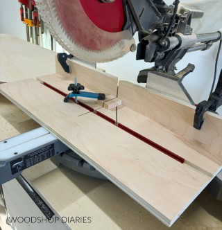
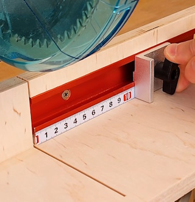

# 2026-07

> This page was created with the assistance of ChatGPT. Information and links should be verified.


## 2026-07-28

### 6-in-1 Universal Trim Router Jig

Jig by **Tamar Hannah / 3x3 Custom**.

A multifunctional base and jig for a trim router. It can be used for freehand routing, flush trimming, trimming edge banding, cutting grooves and mortises, and routing circles.

<!--
Image placeholder:
./_images/2026-07-28-3x3-custom-universal-trim-router-jig.jpg
-->

[](https://www.3x3custom.com/store/6-in-1-universal-trim-router-jig)

- [Demonstration video on Facebook](https://www.facebook.com/share/r/1BzxER4kpn/)
- [Product page at 3x3 Custom](https://www.3x3custom.com/store/6-in-1-universal-trim-router-jig)
- [Build tutorial at 3x3 Custom](https://www.3x3custom.com/tutorials/ultimate-trim-router-jig)


### Don't Make These 10 Table Saw Mistakes

Video by **Thomas Custom Woodworks**.

Ten common mistakes when using a table saw, with a focus on safer and more controlled operation.

<!--
Image placeholder:
./_images/2026-07-28-youtube-thomas-custom-woodworks-table-saw-mistakes-bunX11a5OCk.jpg
-->

[](https://www.youtube.com/watch?v=bunX11a5OCk)

- [Watch on YouTube](https://www.youtube.com/watch?v=bunX11a5OCk)


## 2026-07-29

### Miter Saw Small Parts Jig

Article and video by **Shara / Woodshop Diaries**.

A plywood jig that provides support underneath and behind small workpieces. T-tracks and clamps are used to secure the workpiece without placing your hands close to the saw blade.

<!--
Image placeholder:
./_images/2026-07-29-woodshop-diaries-miter-saw-small-parts-jig.jpg
-->

[](https://www.woodshopdiaries.com/diy-miter-saw-small-parts-jig/)

- [Build instructions at Woodshop Diaries](https://www.woodshopdiaries.com/diy-miter-saw-small-parts-jig/)


### Miter Saw Jig

Video by **[Facebook page or creator name]**.

A second example of a jig for supporting and cutting small workpieces on a miter saw.

<!--
Image placeholder:
./_images/2026-07-29-facebook-miter-saw-jig-1007222492311688.jpg
-->

[](https://www.facebook.com/watch/?ref=saved&v=1007222492311688)

- [Watch on Facebook](https://www.facebook.com/watch/?ref=saved&v=1007222492311688)


> **Working direction:** For a right-handed setup, it can be practical to keep the long stock on the left, operate the saw with the right hand, and advance the stock from left to right between cuts. The cut-to-length piece then ends up on the right.
>
> This is a workflow preference rather than a general rule. When the retained piece is small and sits on the right, it should be supported and secured with a jig or clamp. Do not reach across the blade with the left hand. Only reposition the material after the blade has completely stopped.


## 2026-07-26

### MultiBoard, openGrid and Underware


A [Woodworking.nl discussion](https://www.woodworking.nl/threads/multiboard-french-cleats-alternatief.45826/) discusses MultiBoard and Underware as a 3D-printed alternative to conventional pegboard or French-cleat storage.

The discussion is partly based on the following YouTube video:

[](https://www.youtube.com/watch?v=zgMPVfaCOPs)


MultiBoard and openGrid are separate modular mounting systems. Underware is a cable-management concept with system-specific implementations for both platforms.

- [MultiBoard, openGrid and Underware](./26/multiboard-opengrid-underware)


### CNC Mill Build

This YouTube video documents the construction of a CNC milling machine:

[](https://www.youtube.com/watch?v=wFpyW5FwmGk&t=239s)

The build may provide useful ideas for CNC-machine construction, mechanical layout and component selection.

### 3D-Printed Router Lift

This YouTube video shows a 3D-printed router lift:

[](https://www.youtube.com/watch?v=dJLjQ146v2A)

The design may be useful as a reference for combining 3D-printed parts with a router-table height-adjustment mechanism.


### Docsify Documentation Portal Publisher Guide

The [Documentation Portal Publisher Guide](https://docs.developer.tech.gov.sg/docs/documentation-portal-publisher-guide/?product=Singapore+Government+Developer+Portal) from the Singapore Government Developer Portal is a useful practical reference for building and publishing documentation with Docsify.

The guide includes information about:

- Docsify setup and configuration
- Markdown syntax
- Mermaid diagrams
- Accordion content
- Sidebar configuration and plugins
- Examples of other websites using Docsify

It may be useful both as a Docsify reference and as a source of ideas for improving the structure and navigation of this notebook.


### Life Latitudes CNC Build

This video shows an interesting CNC-machine design:

[](https://www.youtube.com/watch?v=s7sBc1GatWA&t=1357s)

The build uses a `GDZ80X73` spindle.

[HC-Maschinentechnik](https://hc-maschinentechnik.de/) appears to offer useful components and prepared sets for this CNC design.

Relevant products include:

- [Life Latitudes CNC-machine component set](https://hc-maschinentechnik.de/Grondstof-Life-Latitudes-freesmachineset-incl-gaten-schroefdraad)
- [Life Latitudes milling-cutter starter set](https://hc-maschinentechnik.de/Life-Latitudes-frees-starterset)

The component set may be useful because parts are available with holes and threads already machined.

The cutter starter set contains cutters intended for materials such as aluminium, plastics and wood.

### RAPTOR MPX Wooden DIY CNC

Another CNC design is shown in this video:

[](https://www.youtube.com/watch?v=kY_ZBwZwKUE&t=1s)

The accompanying [RAPTOR MPX CNC website](https://www.dolomites-paragliding.com/diycnc) describes a wooden DIY CNC machine.

Main dimensions:

```text
Overall dimensions: 1240 × 1010 × 690 mm
Milling area:       860 × 600 mm
```

The design can be scaled up or down.


### Additional CNC and Aluminium Suppliers

Several additional suppliers and reference projects may be useful for future CNC-machine construction.

#### CNC Machines and Kits

- [Sorotec](https://www.sorotec.de/)  
  Supplier of CNC machines, machine kits, controls, spindles, linear components, tooling and related accessories.

- [Uncle Phil — Volksfräse VF1](https://www.unclephil.de/volksfr%C3%A4se-vf1/)  
  Information and build documentation for the Volksfräse VF1 DIY CNC design.

- [Kamp & Kötter](https://www.kampundkoetter.de/)  
  Supplier of CNC components and machine kits.

- [Kamp & Kötter — Volksfräse VF1](https://www.kampundkoetter.de/maschinen-bausatze/volksfrase-vf1.html)  
  Parts and kits for building the Volksfräse VF1, including frame, linear-motion and upgrade components.

#### CNC Components

- [HC-Maschinentechnik](https://hc-maschinentechnik.de/)  
  CNC components, prepared part sets and milling cutters.

- [CNC-Plus](https://cnc-plus.de/en/)  
  CNC electronics, stepper motors, power supplies, spindle motors and other machine components.

#### Aluminium and Construction Profiles

- [Aluminium Online Shop — Rectangular and Square Tubes](https://www.aluminium-online-shop.de/produkt-kategorie/aluminium-profile/rechteckrohre-vierkantrohre/)  
  Aluminium rectangular and square tubes cut to the requested length.

- [TK Trading 24 — Mounting Profiles](https://tktrading24.de/Montageprofile)  
  Aluminium construction profiles, connectors, hinges, mounting plates and accessories.

- [myAluprofil](https://www.myaluprofil.de/aluminium-profiles/)  
  Aluminium construction profiles compatible with common B-type and I-type profile systems.

- [Alu-Spezi](http://alu-spezi.de/)  
  Supplier of standard aluminium profiles such as flat bars, angle profiles, U-profiles, T-profiles and tubes.

These suppliers cover different parts of a possible CNC build:

```text
machine design and kits
├── Sorotec
├── Volksfräse VF1
└── Kamp & Kötter

CNC electronics and components
├── HC-Maschinentechnik
└── CNC-Plus

aluminium and frame material
├── Aluminium Online Shop
├── TK Trading 24
├── myAluprofil
└── Alu-Spezi
```

### FreeMilli 3.0 Open CNC Design

[FreeMilli](https://freemilli.de/) is an open CNC-router design based on aluminium profiles, linear rails, ball screws and machined aluminium parts.

The design appears to be sufficiently defined for several suppliers to offer matching component sets. However, easily discoverable independent build reports, troubleshooting discussions and long-term user experiences appear to be relatively limited.

Several related names and versions are used:

```text
FreeMilli 2.0 Standard
FreeMilli 3.0 XL
FreeMilli XL
```

Compatibility should therefore be checked against the exact version before ordering parts.

#### Available Component Sets

[DOLD Mechatronik](https://www.dold-mechatronik.de/) offers a dedicated [FreeMilli aluminium profile set](https://www.dold-mechatronik.de/FreeMilli-aluminum-profile-set-heavy).

The set focuses on:

```text
aluminium profiles
brackets
screws
slot nuts
cover caps
```

[Kamp & Kötter](https://www.kampundkoetter.de/maschinen-bausatze/free-milli-by-meisterwoodworker.html) offers FreeMilli linear-motion components, including a [FreeMilli XL linear-motion set](https://www.kampundkoetter.de/freemilli-v1.html).

This package focuses mainly on:

```text
linear guides
ball screws
bearings
axis-drive components
```

[Sorotec](https://www.sorotec.de/shop/Community-Projects/Meister-Woodworker--FreeMilli/?language=en) has a dedicated FreeMilli section for versions including:

```text
FreeMilli 2.0 Standard 1250 × 650
FreeMilli 3.0 XL       1250 × 850
```

Available components include:

- Linear rails
- Ball-screw and bearing sets
- Axis-drive sets
- Stepper motors
- Controls
- Additional accessories

The supplier coverage can be summarised as:

```text
DOLD Mechatronik
└── aluminium profiles and frame hardware

Kamp & Kötter
└── linear-motion and ball-screw components

Sorotec
└── rails, drives, motors, controls and accessories
```

These are separate component packages rather than one complete machine kit.

#### Cost Consideration

Although the design files are openly available, FreeMilli does not appear to be a low-cost CNC project.

The aluminium-profile package already costs several hundred euros, while the linear-motion components can cost around €1,500.

The following parts are still additional:

- Custom-machined aluminium parts
- Motors and drivers
- Controller and power supplies
- Electrical enclosure and wiring
- Spindle and frequency inverter
- Sensors, switches and emergency stop
- Work surface and smaller hardware

A clearly priced supplier for a complete set of custom aluminium parts has not yet been identified.

Based on the known partial costs, a complete build could quickly approach approximately €4,000. A reliable total cannot yet be determined without pricing for the custom-machined parts and the selected electronics and spindle.

#### Summary

FreeMilli appears to be a well-defined open CNC design with matching components available from several suppliers.

```text
advantages
├── downloadable design information
├── defined component requirements
└── matching supplier packages

uncertainties
├── no single complete machine kit
├── limited independent build information
├── unknown cost of custom aluminium parts
└── total build cost likely approaching €4,000
```

Useful starting points:

- [FreeMilli](https://freemilli.de/)
- [DOLD Mechatronik — FreeMilli aluminium profile set](https://www.dold-mechatronik.de/FreeMilli-aluminum-profile-set-heavy)
- [Kamp & Kötter — FreeMilli](https://www.kampundkoetter.de/maschinen-bausatze/free-milli-by-meisterwoodworker.html)
- [Sorotec — Meister Woodworker FreeMilli](https://www.sorotec.de/shop/Community-Projects/Meister-Woodworker--FreeMilli/?language=en)
