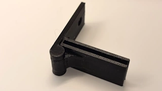
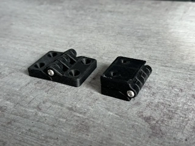
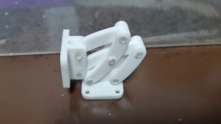
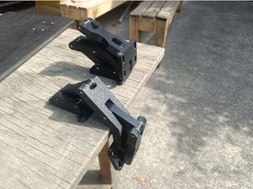
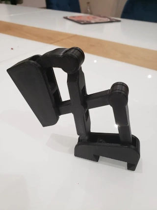
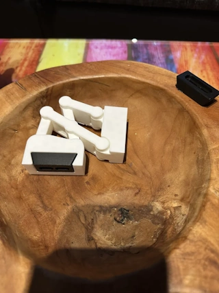
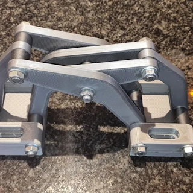
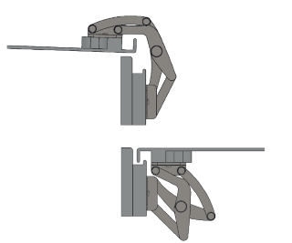

# Hinge Ideas

This page contains 3D-printable hinge ideas for the HUB75 display enclosure.

The examples are possible starting points rather than final selections.

## Stop Hinge

[MakerWorld — Stop Hinge](https://makerworld.com/nl/models/2644412-stop-hinge#profileId-2922394)

This hinge has an integrated stop that limits its maximum opening angle.

It may be useful for a lid or support panel that must stop at a defined angle without a separate cable or support arm.

## 180-Degree Strong Hinge

[MakerWorld — 180° Strong Hinge, 36 mm](https://makerworld.com/nl/models/243010-180deg-strong-hinge-36mm#profileId-259247)

A relatively large external hinge with an opening range of up to 180 degrees.

The linked version is identified as a 36 mm model.

## 180-Degree Opening Gate Hinge

[MakerWorld — 180° Opening Gate Hinge, PETG](https://makerworld.com/nl/models/1175797-180deg-opening-gate-hinge-petg#profileId-1185005)

A gate-style hinge designed to open up to 180 degrees.

The model is intended to be printed in PETG and has accessible external mounting points.

## Multi-Link and Spider Hinges

Multi-link hinges use several pivoting links to control both rotation and movement of a lid or panel.

The mechanism can move the panel away from the enclosure while opening, which may provide clearance around an overlapping edge, raised rim or seal.

### Hidden Hinge

[MakerWorld — Hidden Hinge](https://makerworld.com/nl/models/252533-hidden-hinge#profileId-268869)

A concealed multi-link hinge intended to remain hidden when the connected parts are closed.

The mechanism moves the panel while it rotates and therefore requires recesses and sufficient internal space.

### 180-Degree Concealed Hinge

[Thingiverse — 180 Degree Concealed Hinge](https://www.thingiverse.com/thing:7325370)

Another concealed-hinge design with an opening range of up to 180 degrees.

It may be useful as a reference for a panel that should open almost flat while keeping the hinge hidden when closed.

### Print-in-Place Concealed Hinge

[MakerWorld — Print-in-Place Concealed Hinge](https://makerworld.com/nl/models/195411-print-in-place-concealed-hinge-fidget-toy#profileId-215987)

A concealed multi-link hinge printed as a complete moving assembly.

Although presented as a fidget model, it is a useful reference for print-in-place clearances and concealed linkage movement.

### PIP Hinge for Interior Doors

[MakerWorld — PIP Hinge for Interior Doors](https://makerworld.com/nl/models/1347449-pip-hinge-for-interior-doors)

A remix of the print-in-place concealed hinge, adapted for lightweight interior doors or panels.

It shows how the same linkage principle can be developed into a larger functional hinge.

### 3D-Printable Spider Hinge

[Cults3D — Spider Hinge](https://cults3d.com/en/3d-model/home/spider-hinge)

A 3D-printable interpretation of a spider-hinge mechanism.

The linkage moves the panel away from the enclosure before and while it rotates, which can help clear an overlapping edge or seal.

Metal pins or bolts may be more suitable than printed pivots for a larger or more heavily loaded version.

## Real-World Spider Hinge References

The following commercial metal hinges are included only as references for understanding spider-hinge movement and construction.

They are not currently proposed as parts for the display enclosure.

### Osculati Spider Hinge

[Osculati — Spider Hinge](https://www.osculati.com/en/11330-38.527.01/spider-hinge#prettyPhoto)

A metal spider hinge showing how linked arms can move a panel away from the enclosure while it opens.

### Timage Slim Spider Hinge

[Timage — Slim Spider Hinge with Pin Lock](https://timage.co.uk/marine/slim-spider-hinge-pin-lock.html)

A slim, handed spider hinge with an opening angle of approximately 178 degrees.

The pin lock can hold the hinge in its open position.

## Notes

-