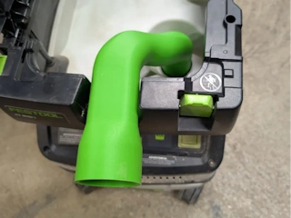

# Festool CTL 15 E External Port

This page investigates existing designs for adding an external dust collection port to a Festool CTL 15 E.

The goal is to develop a solution that allows a cyclone separator to be connected while preserving the original functionality of the dust extractor. Where practical, the final design should use the OsVAC standard instead of proprietary hose connections.

## Design Objectives

- Compatible with the Festool CTL 15 E.
- Preserve the original airflow.
- Maintain the original hose connection.
- Add an external connection for a cyclone separator.
- Prefer OsVAC compatible connections.
- Modular and easy to print.
- Avoid permanent modifications where possible.

---

## Existing Designs

### Cults3D - Front Hose Port Extension for Festool CTM MIDI

**Source**

https://cults3d.com/en/3d-model/tool/front-hose-port-extension-for-festool-ctm-midi

**Image**

**Notes**

- Designed for the Festool CTM MIDI.
- Uses the original Festool hose interface.
- No OsVAC compatibility.
- Good inspiration for the overall concept.

---

### MakerWorld - Festool CT MIDI External Dust Port

**Source**

https://makerworld.com/nl/models/1377712-festool-ct-midi-external-dust-port

A split remix is also available, making the design easier to print.

**Image**

**Notes**

- Designed for the Festool CT MIDI.
- Modular printable construction.
- Interesting approach for adapting to the CTL 15 E.

---

### Printables - Flexible Segmented Vacuum Hose Adapter for Festool

**Source**

https://www.printables.com/model/559792-flexible-segmented-vacuum-hose-adapter-for-festool

**Image**

**Notes**

This design may provide an alternative approach for the internal connection between the Festool CTL 15 E and an external port.

The Festool side of the published adapter appears to use a female Festool hose connection. For use inside the CTL 15 E, this would likely need to be replaced by a male Festool connector that fits directly into the vacuum's internal hose connection.

At the opposite end, the existing hose or DN40 connection could be replaced by an OsVAC 40 interface.

The interesting part of this design is therefore primarily the flexible segmented section and not necessarily the original connectors at either end.

**Possible adaptation**

Festool CTL 15 E internal connection  
- male Festool connector  
- flexible segmented section  
- OsVAC 40 connector  
- external cyclone connection