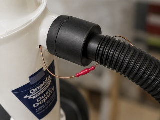
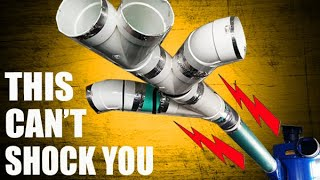
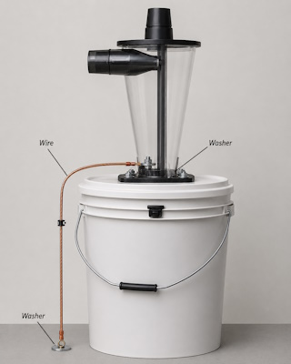
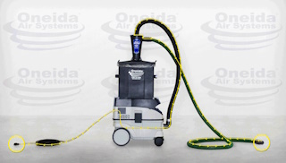
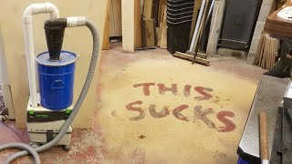

# Grounding

This page collects research and examples related to grounding and static electricity in dust collection systems.

Moving dust and debris can generate static electricity in hoses, cyclone separators and other parts of the dust collection path.

Different approaches are used to reduce or dissipate this static charge. These range from adding a separate grounding conductor to using hoses and components made from conductive or static-dissipative materials.

The purpose of this research is to understand these different approaches before deciding what is appropriate for the Dust Collection System project.

---

## Carbide3D Community - Grounded My Dust Collection System

**Source**

https://community.carbide3d.com/t/grounded-my-dust-collection-system-pics/43370

**Image**



### Implementation

The author uses a shop vacuum together with a Dust Deputy cyclone:

```text
Machine
   │
   ▼
Small diameter hose
   │
   ▼
Dust Deputy cyclone
   │
   ▼
Larger diameter hose
   │
   ▼
Vacuum
```

A bare stranded copper wire is routed through the complete dust collection path.

The wire passes through both hoses and through the cyclone. Small holes are drilled where the wire needs to enter or leave a component.

The different sections are connected electrically using bullet connectors so that the hoses and cyclone can still be disconnected from each other.

At the vacuum end, the grounding wire is connected through a **1 MΩ resistor** to the protective-earth connection of a separate three-prong mains plug.

The author measured slightly more than 1 MΩ between the machine-side end of the grounding wire and the earth pin of this plug.

### Original Description

> "Home Depot had 18 AWG stranded bare copper wire for $0.15 per foot, so I picked up 25 feet of that plus a package of 22-18 AWG bullet connectors. The 18 AWG wire is small enough to fit through a 1/16" hole, so that’s what I drilled wherever it needed to enter or exit a component (2 hoses + the cyclone). I left a 4-6" pigtail at each entrance/exit and crimped an appropriate-gender bullet connector on the pigtail to make the system easily disconnectable when needed."

### Dutch Translation

> Home Depot verkocht blanke, soepele koperdraad van **18 AWG** voor **$0,15 per voet**. De auteur kocht ongeveer **25 voet** draad, samen met een set **22–18 AWG bullet connectors**.
>
> De 18 AWG-draad is dun genoeg om door een gat van **1/16 inch (ongeveer 1,6 mm)** te passen. Daarom boorde hij een klein gat op iedere plaats waar de draad een onderdeel binnenkomt of verlaat: bij de twee slangen en bij de cycloon.
>
> Bij ieder in- en uittredepunt liet hij ongeveer **4–6 inch (circa 10–15 cm)** draad uitsteken. Dit korte uitstekende stuk draad wordt een *pigtail* genoemd.
>
> Aan deze pigtails werden passende male en female **bullet connectors** gekrompen. Hierdoor blijft de aardingsdraad elektrisch doorverbonden, terwijl de afzonderlijke slangen en de cycloon toch eenvoudig losgekoppeld kunnen worden.

### Why the Bullet Connectors?

Without connectors, the copper wire would effectively turn the complete dust collection path into one permanently connected assembly.

The bullet connectors make the grounding conductor modular:

```text
Machine
   │
   ▼
ground wire
   │
 connector
   │
   ▼
Hose
   │
 connector
   │
   ▼
Cyclone
   │
 connector
   │
   ▼
Hose
   │
 connector
   │
   ▼
Ground connection
```

A hose or cyclone can therefore be removed without cutting or completely removing the grounding wire.

### Wire Inside the Cyclone

The author also routes the copper wire through the Dust Deputy itself.

The wire does not closely follow the cyclone wall. It runs down through the cyclone and is mechanically restrained near the bottom before returning upwards and leaving the cyclone again.

The intention is therefore to provide a conductive path throughout the complete dust and airflow path.

### Questions About This Approach

There is an important question about this implementation.

The **copper wire is conductive and grounded, but the plastic hose itself remains an electrical insulator**.

Putting a copper wire inside a plastic hose does not automatically make the complete hose wall conductive.

This raises several questions:

* How does charge accumulated on the plastic hose wall reach the copper wire?
* Does the wire regularly touch the inside of the hose and discharge local areas?
* Is part of the charge transferred through dust particles that subsequently contact the wire?
* Does the wire mainly reduce large discharges rather than prevent charge from accumulating on the complete hose surface?
* How does this compare with a hose whose material is itself conductive or static dissipative?

The author reports that the system previously generated significant static electricity and that after adding the grounding system he no longer noticed static during an initial vacuuming test.

This is useful practical information, but it does not by itself explain exactly how effectively the internal wire discharges all areas of a non-conductive hose.

For this project, the distinction between **grounding a wire inside a hose** and **using a hose that is itself conductive or static dissipative** is therefore important.

### 1 MΩ Resistor

The Carbide3D implementation uses a **1 MΩ resistor** between the grounding conductor and protective earth.

In the discussion, the stated reasons include limiting the rate at which static charge can discharge and avoiding a very low-resistance connection that could contribute to electrical or electronic problems.

This should currently be considered part of the referenced implementation rather than a design decision for this project.

Connecting anything to protective earth is an electrical-safety issue and should not be based solely on this community example.

---

## YouTube - Dust Collection Grounding

**Source**

https://www.youtube.com/watch?v=C1RWjLP5QF0

**Image**



**Notes**

This video is another reference discussing static electricity and grounding in dust collection systems.

It is particularly relevant to the question of whether a non-conductive plastic hose or pipe can actually be "grounded" simply by adding a conductor.

This is useful background when comparing DIY copper-wire solutions with conductive or static-dissipative hoses and components.

---

## Oneida Air Systems - How Should the Dust Deputy Be Grounded?

**Source**

https://www.oneida-air.com/question/how-should-the-dust-deputy-be-grounded-/

**Image**



**Notes**

Oneida describes grounding the Dust Deputy as an optional step for situations involving fine dust or electronically sensitive equipment.

Their instructions mention two approaches:

* applying conductive metal tape;
* adding a separate grounding wire connected to one of the mounting bolts.

This is interesting in comparison with the Carbide3D solution because the grounding conductor is associated with the cyclone itself rather than simply placing a wire through the complete airflow path.

---

## Oneida Air Systems - Ultimate Dust Deputy Grounding Path

**Source**

https://www.oneida-air.com/blog/ultimate-dust-deputy-maintains-grounding-path

**Image**



**Notes**

The Ultimate Dust Deputy uses a different approach.

Oneida states that its components are manufactured from **static-conductive or static-dissipative materials**.

When used with suitable grounding tool hoses and a vacuum with a grounded inlet, the system is designed to maintain a continuous grounding path from the tool through the cyclone to the vacuum.

This differs fundamentally from placing a separate bare copper wire inside an otherwise non-conductive system.

Conceptually:

```text
Tool
  │
  ▼
Grounding / conductive hose
  │
  ▼
Static conductive or dissipative cyclone
  │
  ▼
Grounding / conductive hose
  │
  ▼
Grounded vacuum inlet
```

The conductive properties are therefore part of the components themselves rather than being provided solely by a separate wire running through the airflow.

Oneida also notes that older versions of the Ultimate Dust Deputy required foil tape to maintain the grounding path, while newer versions use a black static-dissipative cyclone.

This approach is especially interesting for the project because it demonstrates that maintaining a grounding path through a cyclone can be treated as a property of the complete hose-and-component system.

---

## YouTube - Festool Cyclone and Grounding

**Source**

https://www.youtube.com/watch?v=ozTCsfFssBc&t=637s

**Image**



**Notes**

This video is relevant both for grounding research and as inspiration for the mechanical construction of a compact Festool-based cyclone system.

The cyclone arrangement and integration with the Festool dust extractor make this a useful reference for a future cyclone design.

This source should therefore also be referenced from the research page about cyclone solutions.

---

## Initial Observations

The references show at least two substantially different approaches.

### Separate Grounding Conductor

A conductive wire is added to an otherwise largely non-conductive dust collection system.

```text
Plastic hose / cyclone
        +
Copper grounding wire
```

The Carbide3D implementation is an example of this approach.

Its practical advantage is that it can be added to existing hoses and components.

An open question is how effectively a relatively small conductor discharges static charge distributed over a much larger insulating plastic surface.

### Conductive or Static-Dissipative System

The hose and cyclone components themselves provide a controlled electrical path.

```text
Conductive hose
      │
      ▼
Conductive / dissipative cyclone
      │
      ▼
Conductive hose
      │
      ▼
Grounding path
```

The newer Ultimate Dust Deputy is an example of this approach.

This appears conceptually cleaner because the grounding path is deliberately integrated into the components that can accumulate static charge.

---

## Open Questions

Before selecting a grounding solution for this project, several questions remain:

* How much static charge is generated in the intended Festool CT 15 E and OsVAC 40 system?
* Are standard OsVAC hoses electrically insulating, conductive or static dissipative?
* Are suitable conductive or anti-static OsVAC 40 hoses available?
* How is the grounding path implemented in original Festool anti-static hoses?
* What happens to the grounding path when a cyclone and 3D-printed OsVAC adapters are inserted between the tool and vacuum?
* Can conductive or static-dissipative filament be useful for custom adapters?
* How effective is a bare wire inside a plastic hose compared with a genuinely conductive hose?
* Is a dedicated grounding conductor necessary if a continuous conductive path can be maintained through the hose, cyclone and vacuum?

At this stage, no grounding method has been selected.
