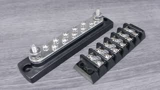
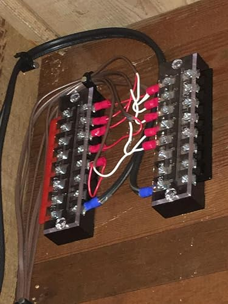

# Power Connectors

This page contains notes and possible solutions for connecting power to the HUB75 LED matrix panels.

## Standard Power Cable

HUB75 LED matrix panels commonly use a four-wire power cable with two 5 V wires and two ground wires.

- [Replacement 5V Power Cable for RGB LED Matrices](https://www.adafruit.com/product/4767)  
  Replacement power cable for HUB75-style RGB LED matrix panels.

- [Questions about the HUB75 power cable](https://forums.adafruit.com/viewtopic.php?t=191378)  
  Discussion about the connector and cable details.

The exact connector family used on the panel side still needs to be identified.

## Cable Termination

The loose cable ends can be fitted with crimp terminals for connection to a screw terminal or power distribution block.

Possible terminations:

- M3 fork terminals
- M3 ring terminals
- Ferrules for clamp-style terminal blocks

Fork terminals are easier to remove because the screw does not need to be removed completely. Ring terminals provide a more secure connection but require the screw to be removed.

## Terminal Block or Busbar

A terminal block normally connects one input and one output per position. Adjacent positions are electrically separate unless they are connected using a jumper strip.

A busbar connects multiple terminals together and is intended for distributing one electrical potential, such as 5 V or ground.

For this project, the preferred solution would be:

- One busbar for 5 V
- One busbar for ground
- M3 screws suitable for the cable terminals
- Enough current capacity for all connected LED panels

- [Busbars vs Terminal Blocks](https://www.youtube.com/watch?v=95ZCdMZOhQM)  
  Explanation of the difference between busbars and terminal blocks.

  

## Barrier Terminal Block

A barrier-style terminal block can also be used when a suitable M3 busbar is difficult to find.

- [Example M3 barrier terminal block](https://www.amazon.nl/HUAZIZ-schroefklemmenblokken-posities-barrièreband-voorgeïsoleerd/dp/B09964YNVT/)  
  Five-position screw terminal blocks supplied with jumper strips.

With a jumper strip installed along one side, all positions on that side can be connected together. One position is needed for the power input, leaving the remaining positions available as outputs.

For example:

- 5 positions
- 1 position for the input
- 4 positions available for panels

Separate terminal blocks should be used for 5 V and ground.

  

## Notes

-