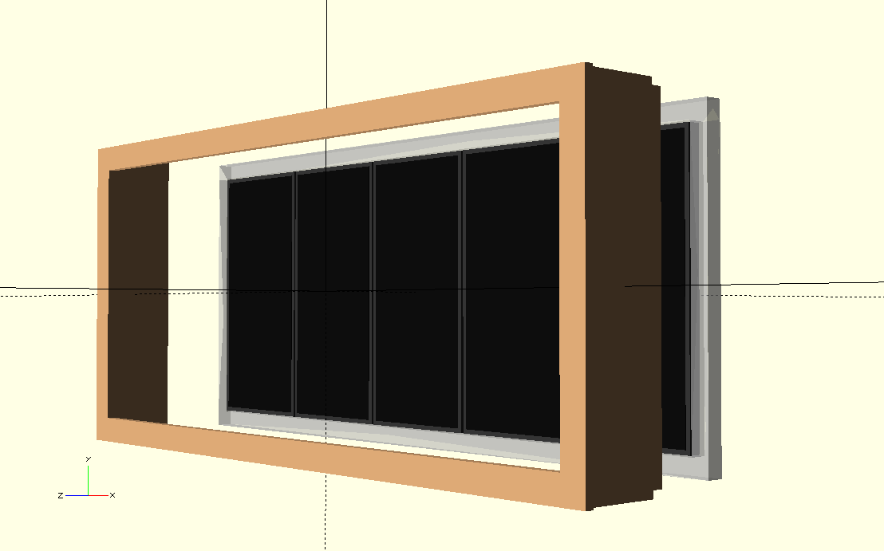
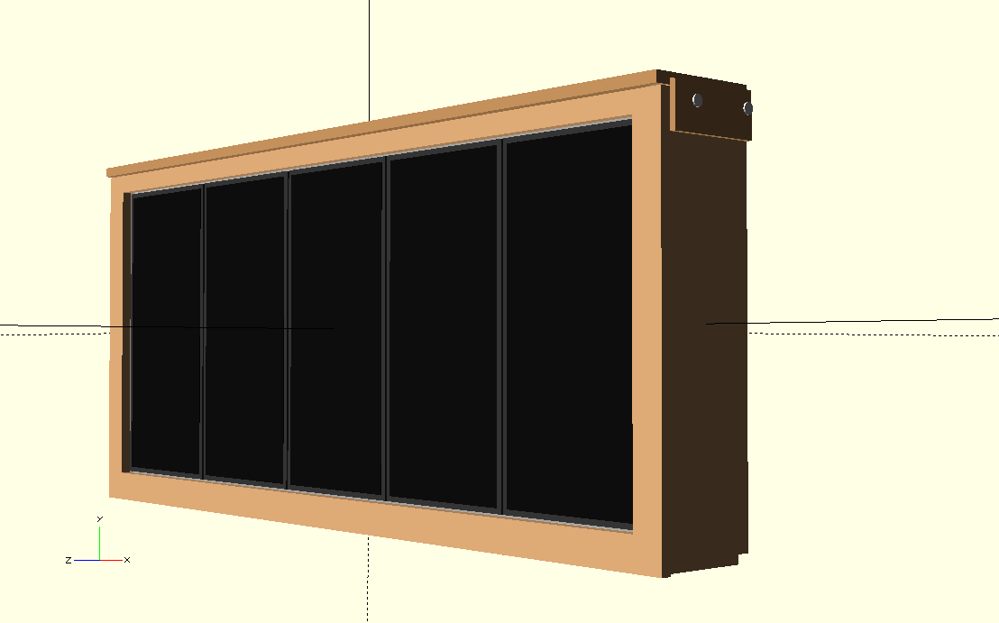
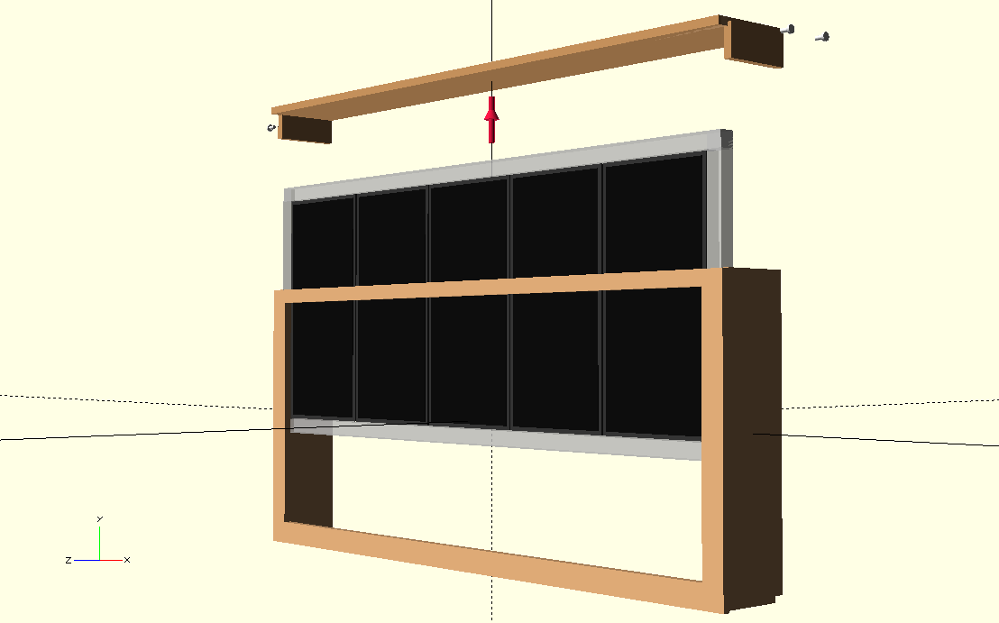

# Design Considerations

This page contains design considerations for the enclosure of the HUB75 LED matrix display.

## Enclosure Concepts

Two enclosure concepts are currently being considered.

## 1. Rear Assembly

In this concept, the enclosure is assembled from the rear.

The display panels, electronics and other internal parts are mounted from the back of the enclosure.

<table>
<tr>
<td width="50%" valign="top">

</td>
<td width="50%" valign="top">

</td>
</tr>
</table>

## 2. Removable Top Cover

In this concept, the top panel of the enclosure acts as a removable lid.

The plexiglass front and possibly a separate frame containing the LED panels can be inserted into the enclosure from the top.

<table>
<tr>
<td width="50%" valign="top">

</td>
<td width="50%" valign="top">

</td>
</tr>
</table>

## Design Source

Both concepts are based on OpenSCAD models.

## Notes

-