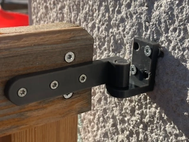
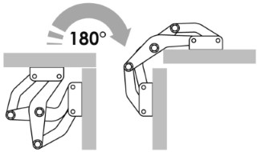

# Hinge Ideas

This page contains 3D-printable hinge ideas for the HUB75 display enclosure.

The examples are collected as possible starting points rather than final selections.

## Stop Hinge

[MakerWorld — Stop Hinge](https://makerworld.com/nl/models/2644412-stop-hinge#profileId-2922394)

This hinge has an integrated stop that limits its maximum opening angle.

It may be useful when a lid or support panel must stop at a defined angle without using a separate cable or support arm.

Possible applications include:

- A hinged rear cover
- A folding support panel
- A lid that also functions as a support
- Limiting the opening angle of an enclosure part

## 180-Degree Strong Hinge

[MakerWorld — 180° Strong Hinge, 36 mm](https://makerworld.com/nl/models/243010-180deg-strong-hinge-36mm#profileId-259247)

This design is presented as a strong hinge with an opening range of up to 180 degrees.

The linked version is identified as a 36 mm model.

It may be useful when a panel must fold completely back against another part of the enclosure.

Possible applications include:

- A fold-back rear panel
- A lid that opens flat
- A support panel that folds against the enclosure
- A cover that must remain out of the way when opened

## 180-Degree Opening Gate Hinge

[MakerWorld — 180° Opening Gate Hinge, PETG](https://makerworld.com/nl/models/1175797-180deg-opening-gate-hinge-petg#profileId-1185005)

This is a 3D-printable gate-style hinge designed to open up to 180 degrees.

The model is intended to be printed in PETG. It may be useful when a lid or support panel needs a relatively large, externally mounted hinge.

Possible applications include:

- A rear panel that opens completely
- A folding support panel
- A lid that folds back against the enclosure
- A larger hinge connection with accessible mounting points

## Multi-Link and Spider Hinges

Multi-link hinges use several pivoting links to control both the rotation and movement path of a lid or panel.

The mechanism can move the panel away from the enclosure while it opens. This may provide additional clearance around an overlapping edge, raised rim or seal.

### Hidden Hinge

[MakerWorld — Hidden Hinge](https://makerworld.com/nl/models/252533-hidden-hinge#profileId-268869)

This is a concealed multi-link hinge.

The mechanism is comparable to a spider hinge because several linked parts move the panel while it opens.

Unlike an externally mounted spider hinge, this design is intended to remain concealed when the connected parts are closed.

Points to consider include:

- Required recesses in the wooden panels
- Available panel thickness
- Clearance during opening
- Strength of the printed parts
- Access to the mounting screws

### Print-in-Place Concealed Hinge

[MakerWorld — Print-in-Place Concealed Hinge](https://makerworld.com/nl/models/195411-print-in-place-concealed-hinge-fidget-toy#profileId-215987)

This model demonstrates a concealed multi-link hinge that is printed as a complete moving assembly.

Although it is presented as a fidget toy, its mechanism may be useful as a reference for:

- Concealed multi-link movement
- Print-in-place clearances
- The movement path of the connected parts
- Adapting the principle to a larger functional hinge

### PIP Hinge for Interior Doors

[MakerWorld — PIP Hinge for Interior Doors](https://makerworld.com/nl/models/1347449-pip-hinge-for-interior-doors#profileId-1389414)

This model is a remix of the print-in-place concealed hinge shown above.

It uses the same general multi-link principle but adapts the mechanism for lightweight interior doors or panels.

The model is useful as an example of how the original concealed-hinge concept can be developed into a more functional design.

Points to consider include:

- Print-in-place clearances
- Required panel recesses
- Load on the linked parts
- Print orientation
- Layer direction around the pivots
- Durability during repeated opening and closing

MakerWorld shows the relationship on the remix model page. The original model page does not provide a clear overview of all remixes based on it.

### 3D-Printable Spider Hinge

[Cults3D — Spider Hinge](https://cults3d.com/en/3d-model/home/spider-hinge)

This model is a 3D-printable interpretation of a spider-hinge mechanism.

Possible applications include:

- A lid that must move away from the enclosure before rotating
- A rear panel with an overlapping edge
- Maintaining clearance around a seal
- A panel that should open almost completely flat

Points to consider include:

- The required movement path
- Space needed for the linkage
- Load on the pivots
- Play between the individual hinge links
- Whether metal pins or bolts should replace printed hinge pins

## Real-World Spider Hinge References

The following commercial metal hinges are included only as references for understanding the movement and construction of spider hinges.

They are not currently proposed as parts for the display enclosure.

### Osculati Spider Hinge

[Osculati — Spider Hinge](https://www.osculati.com/en/11330-38.527.01/spider-hinge#prettyPhoto)

The Osculati hinge is included as an example of a metal spider-hinge mechanism.

Its linked construction illustrates how a panel can be moved away from the enclosure while it opens.

### Timage Slim Spider Hinge

[Timage — Slim Spider Hinge with Pin Lock](https://timage.co.uk/marine/slim-spider-hinge-pin-lock.html)

The Timage version illustrates a slim spider-hinge mechanism with a pin lock.

It opens to approximately 178 degrees. The pin lock can hold the hinge in its open position.

The hinge is handed, so left-hand and right-hand versions are used together for a lid or panel.

Interesting characteristics include:

- A slim multi-link mechanism
- An almost flat opening angle
- A lock that prevents the opened hinge from closing
- A movement path that lifts the panel away from the enclosure

## Notes

-