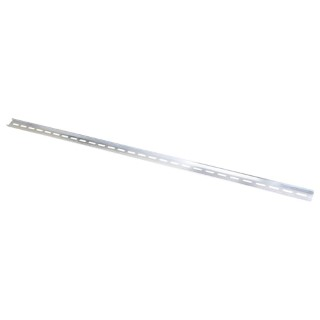
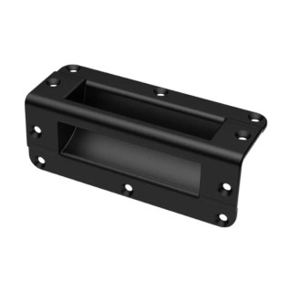
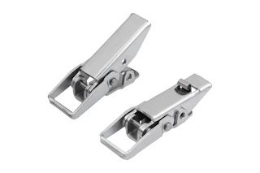
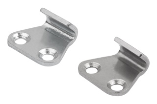

# Parts and Suppliers

This page contains possible parts and suppliers for the HUB75 LED matrix display project.

## DIN Rail

- [Conrad — Mean Well TS35/7.5-1000-AL DIN rail](https://www.conrad.nl/nl/p/mean-well-ts35-7-5-1000-al-din-rail-aluminium-1000-mm-1-stuk-s-3557776.html)  
  Aluminium DIN rail with a length of 1000 mm. Manufacturer part number: `TS35/7.5-1000-AL`. 

## Handle

- [Fritz-Events — Penn Elcom H1025 recessed corner handle](https://www.fritz-events.nl/penn-elcom-h1025-inbouw-hoekgreep-zwart.html)  
  Black recessed corner handle made from an aluminium handle and a plastic dish. The listed dimensions are 150 × 57.2 × 57.2 mm. :contentReference[oaicite:1]{index=1}

## Case Latch

- [KIPP — Toggle latches with wide catch plate](https://www.kippcom.nl/nl/producten/BEDIENDELEN/Spansluitingen-kliksluitingen-dagsloten/Spansluitingen/Stalen-of-roestvrij-stalen-spansluitingen-met-brede-spanbeugel-tot-2000N-schroefboringen-verdekt/p/agid.35696)  
  Intended version: `K2475.2420731`.

- [KIPP — Catch plate for toggle latches](https://www.kippcom.nl/nl/producten/BEDIENDELEN/Spansluitingen-kliksluitingen-dagsloten/Toebehoren-voor-spansluitingen/Tegenhaak-voor-spansluitingen-met-brede-spanbeugel-of-beweegbare-driekantspanbeugel/p/agid.35708)  
  Matching catch plate for the toggle latch.

## Electrical Cable

Possible suppliers for power cable and cable-related components:

- [Cable-Engineer.nl](https://www.cable-engineer.nl/)  
  Supplier of cable, wire, cable terminals, connectors, crimping tools and related components. 

- [Uw Accuwinkel — Twinflex cable](https://www.uw-accuwinkel.nl/nl/kabel/twinflex-kabel)  
  Possible supplier for twinflex power cable.

## Notes

-